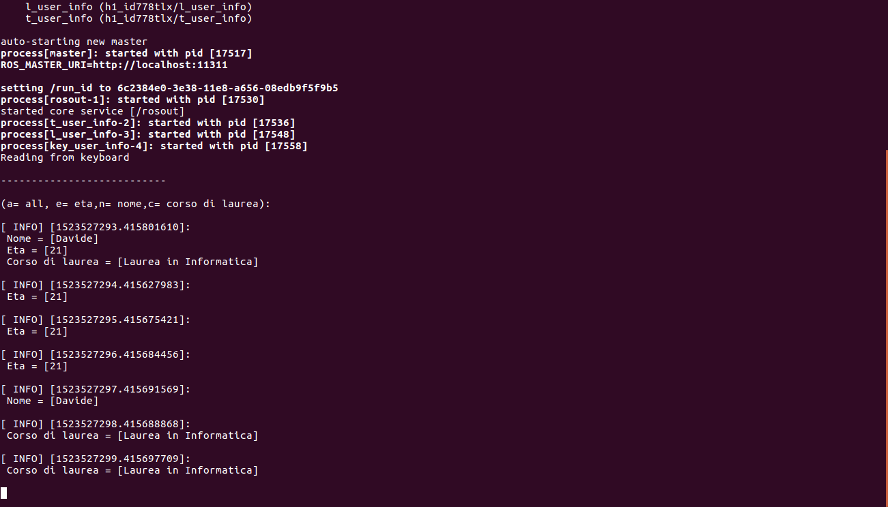

# Homework1 - ROS

* [Getting started](#getting-started)
* [Prerequisites](#prerequisites)
* [Installation](#installation)
* [Running project](#running-project)
* [Traditional method](#traditional-method)
* [Launch file method](#launch-file-method)
* [Project choices](#project-choices)
* [Message format](#message-format)
* [List user options](#list-user-options)
* [Made with](#made-with)
* [Author](#author)
* [Licence](#licence)

First homework of the Ciberfisico laboratory course.


## Getting started

Use the "git clone" command to clone repository in home_catkin/src directory (where "home_catkin" is the ROS's home directory). The repository is called h1_id778tlx and it's uploaded on git hub.

```
git clone https://github.com/davemol/h1_id778tlx.git
```

## Prerequisites

Must install ROS on PC and I suggest to use the last stable version Ubuntu Linux (16.04 LTS).  

## Installation

* Move in ROS's home directory:

```
cd catkin_ws
```

* Run the following command to compile ROS's package:

```
catkin_make --pkg h1_id778tlx
```

## Running project
 
There are two alternatives

### Traditional method

* Run the main node:

```
roscore
```

* Run the "talker" node:

```
rosrun h1_id778tlx t_user_info
```

* Run the "listener" node:

```
rosrun h1_id778tlx l_user_info
```

* Run the "keyboard" node:

```
rosrun h1_id778tlx key_user_info
```

### Launch file method

```
roslaunch h1_id778tlx h1_id778tlx.launch
```




## Project choices

This project is composed by 3 nodes:

* **t_user_info:** this node publishes messages on the topic *user_info* every second - [t_user_info.cpp](src/t_user_info.cpp)

* **l_user_info:** this node signes up on topic *user_info* to receive messages that's published by t_user_info node and signes up on topic *car_choice* to know what the user press on the keyboard (see List user options point). Then the node showes all the body of message or only a part of the message according to the user's choice - [l_user_info.cpp](src/l_user_info.cpp)

* **key_user_info:** this node reads from the keyboard what the user press and then publishes it on the topic *car_choice* -  [key_user_info.cpp](src/key_user_info.cpp)


### Message format

The message format of the messages that are published on the topic *user_info*, is written in [User_info.msg](msg/User_info.msg) file.

### List user options

User can press from the keyboard one of the following options:

* a: show all (old,name,course of study)
* e: show old
* c: show course of study
* n: show name

## Made with

* [ROS](http://wiki.ros.org/catkin) - framework used

## Author

* **Davide Molinari** - *official git page* - [davemol](https://github.com/davemol)

## Licence

This project has the licence - see [LICENSE](LICENSE) file to more details

